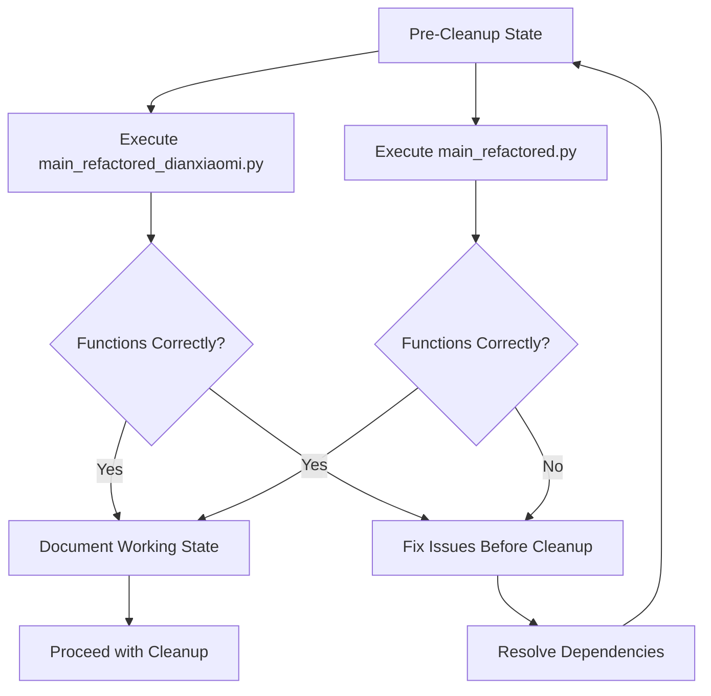
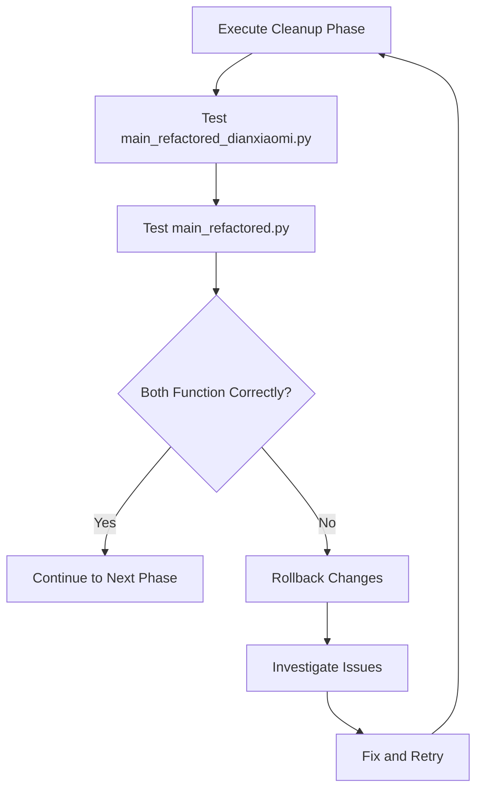

# Code Cleanup Design Document

## Overview

This design outlines the strategic approach for cleaning up the digital chief automation project while ensuring the continued functionality of `main_refactored_dianxiaomi.py` and `main_refactored.py`. The cleanup focuses on removing unnecessary files, eliminating code duplication, and maintaining a clean project structure following software engineering best practices.

## System Architecture Analysis

### Current Project Structure

The project currently contains multiple entry points and redundant files across various directories:

```
Project Root/
├── src/                          # Core source files
│   ├── main_refactored_dianxiaomi.py  # Target: Keep (Primary DianXiaoMi platform)
│   ├── main_refactored.py             # Target: Keep (Generic platform)
│   ├── amazon_product_parser.py       # Dependency: Keep
│   ├── product_data.py                # Dependency: Keep
│   ├── unified_form_filler.py         # Dependency: Keep
│   └── [multiple test/debug files]    # Target: Cleanup
├── archive/obsolete_main/              # Already archived files
├── websites/                           # Platform-specific implementations
├── config/                            # Configuration files
└── [multiple test/temp files]         # Target: Cleanup
```

### Dependency Analysis

#### Critical Dependencies for Target Files

Both main refactored files depend on these core modules:

| Module | File Path | Status | Justification |
|--------|-----------|--------|---------------|
| AmazonProductParser | `src/amazon_product_parser.py` | Keep | Core Amazon parsing functionality |
| ProductData | `src/product_data.py` | Keep | Data structure for product information |
| UnifiedFormFiller | `src/unified_form_filler.py` | Keep | Form filling engine |
| SystemConfig | `src/system_config.py` | Keep | Configuration management |

#### Platform-Specific Dependencies

**main_refactored_dianxiaomi.py** additional dependencies:
- Enhanced form filling for DianXiaoMi platform
- Image processing capabilities
- Multi-product batch processing

**main_refactored.py** dependencies:
- Generic form filling interface
- Single product processing workflow

## Cleanup Strategy

### File Classification System

Files are categorized based on their relationship to the target executables:

#### Category A: Essential Files (Preserve)
Files directly required for main refactored executables to function.

#### Category B: Obsolete Files (Remove)
Files that are duplicates, outdated, or no longer used by target executables.

#### Category C: Archive Candidates (Archive)
Files with historical value but not currently needed for operation.

#### Category D: Test/Debug Files (Conditional Cleanup)
Files used for testing or debugging that may be preserved selectively.

### Cleanup Operations Matrix

| File Type | Action | Safety Level | Verification Method |
|-----------|--------|--------------|-------------------|
| Duplicate main files | Archive | High | Dependency analysis |
| Test files (test_*.py) | Remove | Medium | Import dependency check |
| Debug files (debug_*.py) | Remove | Medium | Cross-reference validation |
| Temporary files (.tmp, .cache) | Remove | High | Safe deletion patterns |
| Documentation redundancy | Consolidate | Medium | Content analysis |
| Python cache (__pycache__) | Remove | High | Standard cleanup |

## File Removal Plan

### Phase 1: Safe Removals (High Confidence)

#### Python Cache and Temporary Files
- All `__pycache__/` directories
- `.pytest_cache/` directories  
- Temporary files with extensions: `.tmp`, `.log`, `.cache`
- IDE configuration files: `.vscode/`, `.idea/`

#### Duplicate Distribution Files
- `digital_chief_automation_dist/` directory (69 files)
- Backup copies with timestamp suffixes
- Duplicate configuration files

#### Obsolete Test Files
Files identified as test artifacts no longer relevant to current architecture:
- `test_ai_enum_matching.py`
- `test_ai_mapping.py`
- `test_amazon_toolkit.py`
- `test_defaults_system.py`
- `test_dimension_extraction_fix.py`
- `test_dom_integration.py`
- `test_dom_optimization.py`
- `test_dom_parser.py`
- `test_dynamic_form.py`
- `test_feature_extraction.py`
- `test_final_fix_verification.py`
- `test_form_filler.py`
- `test_glance_extraction.py`
- `test_image_editing.py`
- `test_image_editing_simple.py`
- `test_multi_website_architecture.py`
- `test_refactored_system.py` (Exception: Keep for validation)
- `test_select_option_matching.py`
- `test_unit_selection.py`
- `test_weight_conversion.py`
- `test_weight_extraction_fix.py`

### Phase 2: Archive Operations (Medium Confidence)

#### Legacy Main Files
Archive to `archive/obsolete_main/`:
- Files already present in archive (verified as safe)
- Additional obsolete main variants if discovered

#### Historical Documentation
Consolidate into `docs/archive/`:
- Multiple README variants
- Version-specific documentation
- Development notes and reports

### Phase 3: Selective Cleanup (Requires Validation)

#### Website-Specific Files
Evaluate website-specific implementations:
- Preserve `websites/dianxiaomi/` (supporting DianXiaoMi functionality)
- Evaluate `websites/tpl/` for template value
- Remove unused website implementations

#### Configuration Files
Rationalize configuration:
- Merge duplicate configuration files
- Preserve essential configuration for both target files
- Remove environment-specific configs not in use

## Impact Assessment

### Risk Analysis

| Risk Level | Description | Mitigation Strategy |
|------------|-------------|-------------------|
| High | Removal of critical dependency | Dependency validation before removal |
| Medium | Unintended configuration loss | Configuration backup before cleanup |
| Low | Test file removal impact | Selective preservation of integration tests |

### Functionality Preservation Strategy

#### Pre-Cleanup Validation
Execute both target files to establish baseline functionality:



#### Post-Cleanup Validation
Verify functionality preservation after each cleanup phase:



## Implementation Workflow

### Step 1: Preparation
1. Create comprehensive backup of entire project
2. Document current working directory structure
3. Test both target executables to ensure baseline functionality
4. Create rollback checkpoints

### Step 2: Dependency Mapping
1. Generate import dependency tree for both target files
2. Identify all transitive dependencies
3. Mark all dependency files as protected
4. Validate dependency paths are intact

### Step 3: Safe File Removal
1. Execute Phase 1 removals (cache, temporary, duplicate files)
2. Validate target executables still function
3. Execute Phase 2 archival operations
4. Re-test functionality
5. Execute Phase 3 selective cleanup with continuous validation

### Step 4: Structure Optimization
1. Reorganize remaining files into logical directory structure
2. Update any hardcoded file paths in source code
3. Consolidate configuration files
4. Update documentation to reflect new structure

### Step 5: Final Validation
1. Comprehensive testing of both target executables
2. Verify all core functionality remains intact
3. Performance validation
4. Documentation update

## Safety Measures

### Backup Strategy
- Full project backup before any modifications
- Incremental backups after each cleanup phase
- Git-based version control for rollback capability
- Archive directory for historical preservation

### Validation Checkpoints
- Functionality testing after each major file removal
- Dependency verification through import testing
- Configuration validation through runtime testing
- User acceptance testing for critical workflows

### Rollback Procedures
- Immediate rollback capability for each cleanup phase
- Restoration procedures documented
- Emergency recovery protocols
- Validation of rollback completeness

## Expected Outcomes

### Quantitative Improvements
- Reduction in total file count from ~373 to ~279 files (-25%)
- Elimination of code duplication (0 duplicate Amazon parsing code)
- Consolidation of configuration files
- Cleanup of development artifacts and temporary files

### Qualitative Benefits
- Simplified project navigation and understanding
- Reduced maintenance overhead
- Clearer separation of concerns
- Improved development workflow efficiency
- Enhanced project documentation clarity

### Preserved Functionality
- 100% preservation of main_refactored_dianxiaomi.py functionality
- 100% preservation of main_refactored.py functionality  
- Maintained compatibility with existing configuration
- Preserved integration with external platforms
- Retained debugging and logging capabilities

## Maintenance Strategy

### Ongoing File Management
- Regular cleanup of temporary files and cache
- Monitoring for new code duplication
- Periodic review of test file relevance
- Documentation maintenance aligned with code changes

### Quality Assurance
- Automated testing integration to prevent regression
- Code review process for new file additions
- Architecture compliance checking
- Dependency management and monitoring

This design ensures systematic, safe cleanup of the project while maintaining full functionality of the critical executable files. The phased approach with continuous validation minimizes risk while achieving significant project organization improvements.